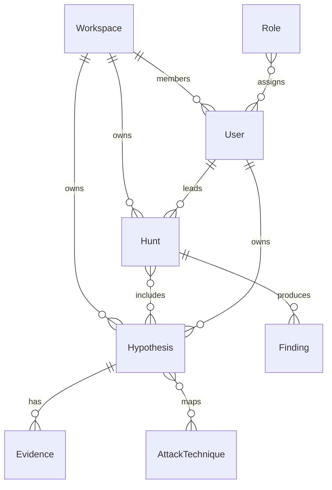

# THMP core data model

This document freezes the Phase 1 core data model described in the THMP Full Build Plan (Section 3). All services, APIs, migrations, and UI flows MUST conform to these entities, fields, enums, and relationships unless superseded by a formal architecture decision record (ADR).

## Conventions

- Primary keys are UUIDs unless noted.
- Timestamps are stored in UTC (`timestamp with time zone` in PostgreSQL).
- `JSONB` fields are schematised in API contracts (Pydantic / OpenAPI); the database stores validated documents only.
- Multi-tenancy: every tenant-owned record carries `workspace_id` where applicable.

## Entity relationship overview

## Hypothesis

Central entity. Every other platform entity relates to a hypothesis except global catalogue data (e.g. ATT&CK techniques).

| Field | Type | Description |
|-------|------|-------------|
| `id` | UUID | Primary key |
| `title` | string (max 256) | Short descriptive title |
| `description` | text | Full narrative |
| `status` | enum | See [Hypothesis status](#hypothesis-status) |
| `confidence_score` | float [0, 1] | Composite confidence (derived; stored for query) |
| `severity` | enum | See [Severity](#severity) |
| `owner_id` | UUID → User | Currently responsible analyst |
| `workspace_id` | UUID → Workspace | Tenancy boundary |
| `source_type` | enum | See [Hypothesis source type](#hypothesis-source-type) |
| `source_ref` | JSONB | Reference to originating external alert/finding |
| `attack_technique_ids` | UUID[] → AttackTechnique | Linked MITRE ATT&CK techniques |
| `tags` | string[] | Free-form tags |
| `due_date` | timestamp, nullable | Target resolution date |
| `created_by` | UUID → User | Creator |
| `created_at` | timestamp | Created |
| `updated_at` | timestamp | Last modified |
| `closed_at` | timestamp, nullable | Set when status is terminal (`validated`, `closed`, or `archived` per workflow rules) |
| `metadata` | JSONB | Connector-specific extensions |

### Hypothesis status

| Value | Description |
|-------|-------------|
| `draft` | Created; not yet active assignment workflow |
| `active` | Assigned and under consideration |
| `in_hunt` | Investigated under a named Hunt |
| `validated` | Confirmed threat activity after hunt |
| `closed` | Ruled out or not actionable |
| `archived` | Historical; hidden from active views |

Status transitions are enforced by application rules (see build plan Section 6.1); not all transitions are valid from every state.

### Hypothesis source type

| Value | Description |
|-------|-------------|
| `manual` | Created by an analyst |
| `intel_feed` | Threat intelligence ingestion |
| `scm` | Elastic Supply Chain Monitor |
| `siem` | SIEM / detection platform |
| `vuln_scanner` | Vulnerability management feed |

### Severity

| Value |
|-------|
| `informational` |
| `low` |
| `medium` |
| `high` |
| `critical` |

## Hunt

Groups one or more hypotheses into a campaign with scope, timeline, and assignments.

| Field | Type | Description |
|-------|------|-------------|
| `id` | UUID | Primary key |
| `name` | string | Campaign name |
| `description` | text | Scope and objectives |
| `status` | enum | See [Hunt status](#hunt-status) |
| `lead_id` | UUID → User | Hunt lead |
| `assigned_analyst_ids` | UUID[] | Participants |
| `hypothesis_ids` | UUID[] | Hypotheses in scope (ordered application-side if needed) |
| `start_date` | timestamp | Planned or actual start |
| `end_date` | timestamp, nullable | Planned or actual end |
| `workspace_id` | UUID → Workspace | Tenancy boundary |
| `created_at` | timestamp | Created |
| `updated_at` | timestamp | Last modified |

### Hunt status

| Value | Description |
|-------|-------------|
| `planned` | Scheduled, not started |
| `active` | In progress |
| `completed` | Finished successfully |
| `cancelled` | Abandoned |

## Evidence

Immutable once committed: updates create a new row (new `id`) with an incremented `version`; prior rows are retained for history.

| Field | Type | Description |
|-------|------|-------------|
| `id` | UUID | Primary key |
| `hypothesis_id` | UUID → Hypothesis | Parent hypothesis |
| `type` | enum | See [Evidence type](#evidence-type) |
| `title` | string | Short description |
| `content` | text, nullable | Inline content (IOC, log snippet, note) |
| `storage_key` | string, nullable | Object store key for file types |
| `mime_type` | string, nullable | MIME type for files |
| `iocs` | JSONB[] | Extracted IOCs (`ip`, `domain`, `hash`, `url`, `email`) |
| `supports_hypothesis` | boolean | Supports vs refutes |
| `weight` | float [0, 1] | Analyst-assigned evidential weight |
| `version` | integer | Monotonic per logical evidence chain (application-defined grouping if multi-row) |
| `submitted_by` | UUID → User | Submitter |
| `created_at` | timestamp | Submission time |

### Evidence type

| Value |
|-------|
| `file` |
| `ioc` |
| `log_snippet` |
| `siem_query` |
| `screenshot` |
| `network_capture` |
| `note` |

## Finding

Formal outcome of a completed hunt. Primary export artefact for reports and STIX bundles.

| Field | Type | Description |
|-------|------|-------------|
| `id` | UUID | Primary key |
| `hunt_id` | UUID → Hunt | Originating hunt |
| `hypothesis_ids` | UUID[] | Hypotheses covered by this finding |
| `title` | string | Short title |
| `narrative` | text | What was confirmed, ruled out, and context |
| `outcome` | enum | `confirmed` \| `refuted` \| `inconclusive` \| `mixed` |
| `recommended_actions` | text, nullable | Remediation or follow-up |
| `workspace_id` | UUID → Workspace | Tenancy boundary |
| `created_by` | UUID → User | Author (typically hunt lead) |
| `created_at` | timestamp | Created |

## AttackTechnique (ATT&CK catalogue)

Local copy of the MITRE ATT&CK technique catalogue, synced from the official STIX bundle on a schedule. Hypotheses link many-to-many to techniques.

| Field | Type | Description |
|-------|------|-------------|
| `id` | UUID | Primary key (internal) |
| `stix_id` | string | Official STIX ID (stable external reference) |
| `name` | string | Technique name |
| `description` | text | MITRE description |
| `tactic_ids` | UUID[] | Parent tactics (internal IDs) |
| `is_sub_technique` | boolean | Sub-technique flag |
| `parent_technique_id` | UUID, nullable | Parent technique if sub-technique |
| `platforms` | string[] | e.g. Windows, Linux, Cloud |
| `updated_at` | timestamp | Last sync update |

Tactics and matrices follow the same pattern hierarchically (Matrices → Tactics → Techniques → Sub-techniques); detailed tactic/matrix table layout is left to the ATT&CK service schema but MUST preserve MITRE `stix_id` for export.

## Audit log

Append-only ledger of state-changing operations.

| Field | Type | Description |
|-------|------|-------------|
| `id` | UUID | Primary key |
| `occurred_at` | timestamp | Event time |
| `actor_user_id` | UUID, nullable | Authenticated user (null for system) |
| `actor_ip` | string, nullable | Source IP if available |
| `action` | string | Normalised verb (e.g. `hypothesis.update`) |
| `entity_type` | string | e.g. `hypothesis`, `evidence` |
| `entity_id` | UUID | Affected entity |
| `workspace_id` | UUID, nullable | Tenancy context |
| `diff` | JSONB | Before/after or patch representation |
| `request_id` | string, nullable | Correlation / trace ID |

Application code MUST NOT update or delete audit rows. Storage MAY be a separate database or tablespace per deployment; logical model is unchanged.

## Supporting entities

### User

| Field | Type | Description |
|-------|------|-------------|
| `id` | UUID | Primary key |
| `email` | string, unique | Login / notification address |
| `display_name` | string | Profile |
| `password_hash` | string, nullable | Local auth only |
| `is_active` | boolean | Soft disable |
| `created_at` / `updated_at` | timestamp | Audit |

Authentication factors (TOTP, SSO subject identifiers) are stored in related tables or identity provider; not duplicated here.

### Workspace

| Field | Type | Description |
|-------|------|-------------|
| `id` | UUID | Primary key |
| `name` | string | Team / BU name |
| `slug` | string, unique | URL-safe identifier |
| `created_at` / `updated_at` | timestamp | Audit |

### Role

Named permission set. Assignments are per workspace.

| Field | Type | Description |
|-------|------|-------------|
| `id` | UUID | Primary key |
| `name` | string | e.g. `analyst`, `hunt_lead`, `ti_analyst`, `manager`, `admin`, `read_only` |
| `description` | text, nullable | Human-readable |

**Workspace membership** (junction): `user_id`, `workspace_id`, `role_id`, `created_at`.

Built-in role names align with the build plan Section 7.3; custom roles (Phase 6) extend this table without breaking the core model.

### Integration config

Per-workspace connector configuration. Secrets are stored encrypted (envelope encryption); this table holds non-secret parameters and references to secret material.

| Field | Type | Description |
|-------|------|-------------|
| `id` | UUID | Primary key |
| `workspace_id` | UUID → Workspace | Owner |
| `connector_type` | string | Registered connector identifier |
| `display_name` | string | UI label |
| `config` | JSONB | Non-secret settings |
| `secret_ref` | string, nullable | Reference into secrets manager / vault |
| `enabled` | boolean | Toggle |
| `created_at` / `updated_at` | timestamp | Audit |

### Notification rule

| Field | Type | Description |
|-------|------|-------------|
| `id` | UUID | Primary key |
| `workspace_id` | UUID → Workspace | Owner |
| `event_type` | string | Platform event key |
| `channel` | enum | `slack` \| `teams` \| `pagerduty` \| `email` \| … |
| `channel_config` | JSONB | Webhook URL, routing, templates |
| `enabled` | boolean | Toggle |
| `created_at` / `updated_at` | timestamp | Audit |

### Report template

| Field | Type | Description |
|-------|------|-------------|
| `id` | UUID | Primary key |
| `workspace_id` | UUID → Workspace | Owner |
| `name` | string | Template name |
| `template_body` | text or binary ref | Engine-specific template |
| `branding` | JSONB | Logo URL, colours, header/footer |
| `created_at` / `updated_at` | timestamp | Audit |

## Cross-cutting rules

1. **Foreign keys**: All references enforce referential integrity at the database layer where the owning service persists the data.
2. **Soft delete**: Not part of the core model; archival uses `hypothesis.status = archived` and equivalent patterns.
3. **Scoring**: `confidence_score` on Hypothesis is derived from workspace-configurable factors (analyst rating, evidence quality, signal strength); storage format is a single float for list views and reporting.
4. **STIX export**: External technique identifiers use `AttackTechnique.stix_id`; findings map to STIX Report per build plan Section 8.2.

## Change control

Changes to this document require an ADR and a migration strategy (API versioning, backward-compatible DB changes per build plan Section 9.5).
